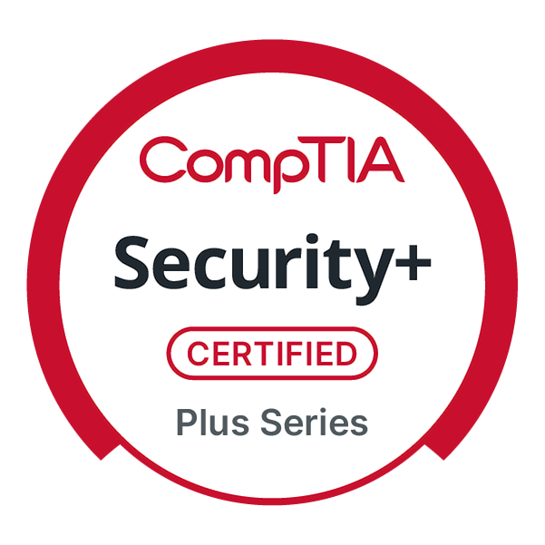
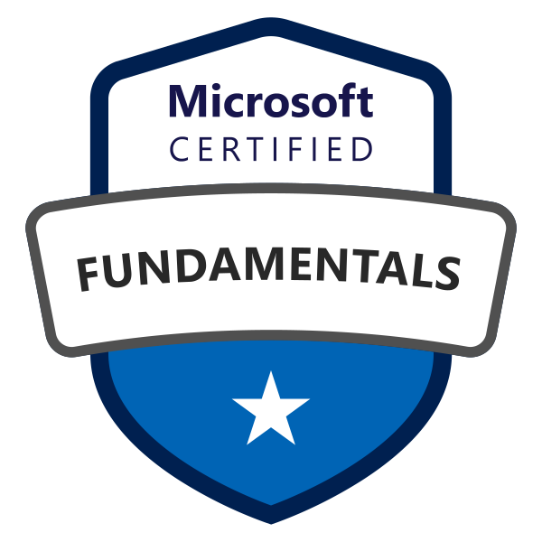
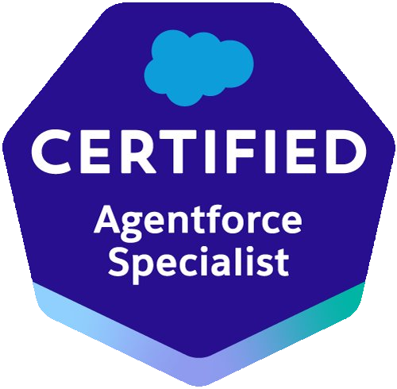
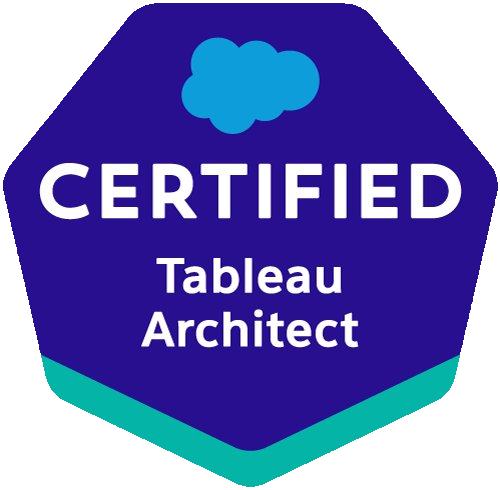

### Hi, I'm Keith 👋

I'm a **technical architect** and **U.S. Air Force veteran**. After a career in the Air Force, I moved into the corporate world, where my work has spanned systems administration and architecture. More recently, curiosity has carried me into development - not a pivot so much as a natural progression, one that's helped round out how I understand the systems I design and run. I've enjoyed the process enough that it's becoming a genuine hobby - and I love turning *"I wish a tool did X"* into a tool that actually does X.

I bring an architect's instincts to everything I build: deliberate design, audit trails, reversible workflows, and rules that generalize instead of one-off fixes - I care as much about *how* something is built as *what* it does.

#### 🔭 What I'm building

- **[QuerySmith](https://github.com/jameskhair-code/calibre-querysmith)** - a Calibre plugin that builds library searches by field, so you never have to memorize the query syntax. Read-only, non-destructive, and friendly to custom columns.
- **[calibre-metadata-toolkit](https://github.com/jameskhair-code/calibre-metadata-toolkit)** - a work-in-progress toolkit for enriching, correcting, and validating book metadata at scale, on a careful, gated, review-before-apply pipeline.

#### 🛠️ Tools I reach for

Python · Calibre · Git & GitHub — with a soft spot for non-destructive, idempotent workflows.

#### 🎓 Certifications

  
  &nbsp;
  
  &nbsp;
  
  &nbsp;
  

#### 🌱 Currently

Going deeper into Python and growing my Calibre toolkit, one project at a time.

---

Always up for talking shop about metadata, tooling, or bringing structure to messy data - or connect with me on [LinkedIn](https://www.linkedin.com/in/jameskeithhair/).
